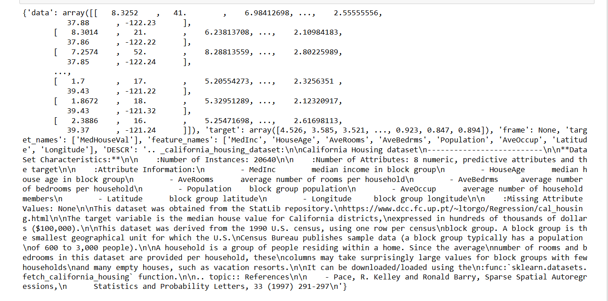
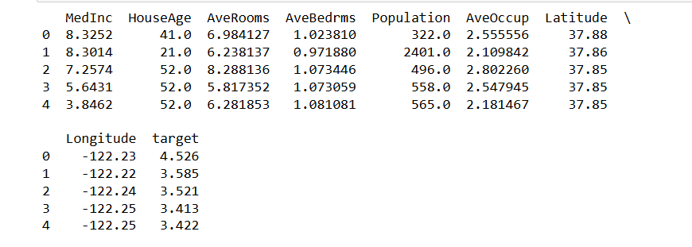
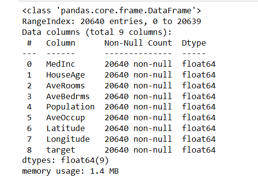
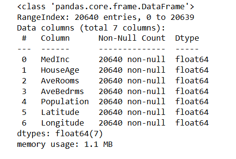
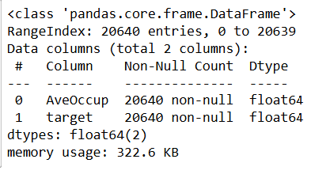
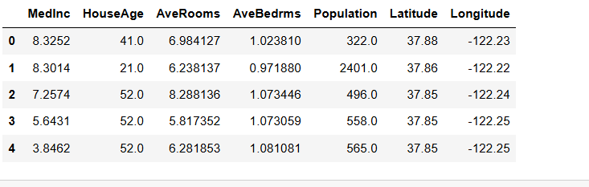
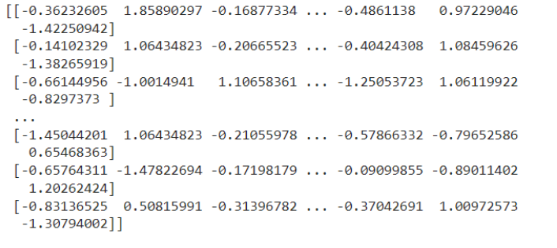
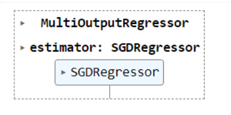
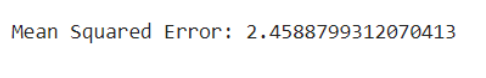
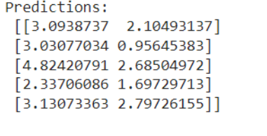

# SGD-Regressor-for-Multivariate-Linear-Regression

## AIM:
To write a program to predict the price of the house and number of occupants in the house with SGD regressor.

## Equipments Required:
1. Hardware – PCs
2. Anaconda – Python 3.7 Installation / Jupyter notebook

## Algorithm
1. Start
2. Data Preparation 
3. Hypothesis Definition
4. Cost Function
5. Parameter Update Rule
6. Iterative Training
7. Model Evaluation 
8. End

## Program:
```
/*
Program to implement the multivariate linear regression model for predicting the price of the house and number of occupants in the house with SGD regressor.
Developed by: viswanadham venkata sai sruthi
RegisterNumber: 212223100061 
*/
```
```
import numpy as np
import pandas as pd
from sklearn.datasets import fetch_california_housing
from sklearn.linear_model import SGDRegressor
from sklearn.multioutput import MultiOutputRegressor
from sklearn.model_selection import train_test_split
from sklearn.metrics import mean_squared_error
from sklearn.preprocessing import StandardScaler
```
```
data=fetch_california_housing()
print(data)
```

```
df=pd.DataFrame(data.data,columns=data.feature_names)
df['target']=data.target
print(df.head())
```

```
df.info()
```

```
x=df.drop(columns=['AveOccup','target'])
x.info()
```

```
y=df[['AveOccup','target']]
y.info()
```

```
x_train,x_test,y_train,y_test=train_test_split(x,y,test_size=0.2,random_state=1)
x.head()
```

```
scaler_x=StandardScaler()
scaler_y=StandardScaler()
x_train=scaler_x.fit_transform(x_train)
x_test=scaler_x.transform(x_test)
y_train=scaler_y.fit_transform(y_train)
y_test=scaler_y.transform(y_test)
print(x_train)
```

```
sgd=SGDRegressor(max_iter=1000,tol=1e-3)
multi_output_sgd=MultiOutputRegressor(sgd)
multi_output_sgd.fit(x_train,y_train)
```

```
y_pred=multi_output_sgd.predict(x_test)
y_pred=scaler_y.inverse_transform(y_pred)
y_test=scaler_y.inverse_transform(y_test)
mse=mean_squared_error(y_test,y_pred)
print("Mean Squared Error:",mse)
```

```
print("\nPredictions:\n", y_pred[:5])
```



## Result:
Thus the program to implement the multivariate linear regression model for predicting the price of the house and number of occupants in the house with SGD regressor is written and verified using python programming.
